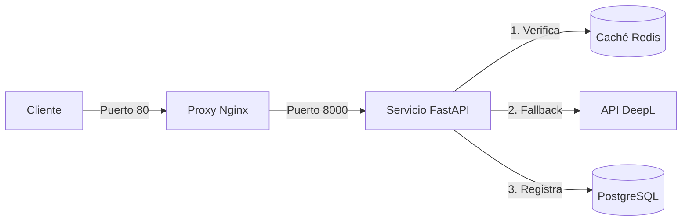

# 🌐 Microservicio de Traducción Inteligente (Smart Translator)

<div align="center">


Una API de traducción de alto rendimiento contenerizada, diseñada como un middleware inteligente sobre DeepL.  
Optimizada para reducir costos y latencia, garantizando la seguridad mediante estrategias de **Rate Limiting** y **Caché**.

</div>

---

## 🏗 Arquitectura y Flujo

Este microservicio implementa el patrón **Cache-Aside** para minimizar las llamadas a APIs externas.



| Etapa            | Descripción                                                                                                                                                                                              |
| ---------------- | -------------------------------------------------------------------------------------------------------------------------------------------------------------------------------------------------------- |
| **Ingreso**      | Nginx actúa como Proxy Inverso, gestionando el tráfico entrante y redirigiéndolo a la API.                                                                                                               |
| **Seguridad**    | El sistema aplica Rate Limiting (algoritmo Token Bucket) para prevenir abusos (defecto: 5 peticiones/min).                                                                                               |
| **Optimización** | **Hit:** Si la traducción existe en Redis, retorna inmediatamente (Latencia ~0ms, Costo $0). **Miss:** Si no existe, consulta a DeepL, guarda el resultado en caché (TTL 24h) y registra la transacción. |
| **Persistencia** | Todas las transacciones son auditadas en PostgreSQL para análisis histórico.                                                                                                                             |

---

## 🚀 Características Principales

- ⚡ **Caché Inteligente:** Utiliza Redis para almacenar traducciones recientes, reduciendo el consumo de la API externa hasta en un 90% para consultas repetitivas.

- 🛡️ **Rate Limiting:** Protege la infraestructura y las cuotas de la API utilizando slowapi (basado en Redis).

- 📊 **Auditoría Persistente:** Registro asíncrono de cada petición en PostgreSQL utilizando SQLAlchemy.

- 🐳 **Infraestructura Lista para Producción:** Entorno totalmente dockerizado con Nginx como gateway y contenedores aislados para BD y Caché.

---

## 🛠 Stack Tecnológico

| Componente    | Tecnología      | Rol                                              |
| ------------- | --------------- | ------------------------------------------------ |
| Lenguaje      | Python 3.11     | Lógica del núcleo                                |
| Framework     | FastAPI         | API REST Asíncrona                               |
| Base de Datos | PostgreSQL      | Datos Históricos y Auditoría                     |
| Caché         | Redis           | Almacenamiento rápido y Backend de Rate Limiting |
| Servidor      | Uvicorn / Nginx | Servidor ASGI y Proxy Inverso                    |
| Contenedor    | Docker Compose  | Orquestación de servicios                        |

---

## ⚙️ Configuración Local

### Prerrequisitos

- Docker y Docker Compose
- Una API Key de DeepL (Free o Pro)

### Instalación

**1. Clonar el repositorio:**

```bash
git clone https://github.com/TheMattGH/Smart-Translator-API.git
cd Smart-Translator-API
```

**2. Configurar Entorno:**

Crea un archivo `.env` en la raíz del proyecto basado en el siguiente ejemplo:

```env
DEEPL_API_KEY=tu_clave_deepl_aqui
DEEPL_URL=https://api-free.deepl.com/v2/translate

# Base de Datos y Caché (Valores por defecto de Docker)
DATABASE_URL=postgresql+asyncpg://user:password@db:5432/translator_db
REDIS_HOST=cache
REDIS_PORT=6379
```

**3. Construir y Levantar:**

```bash
docker-compose up --build
```

**4. Acceder a la Documentación:**

Navega a http://localhost/docs para interactuar con la interfaz Swagger UI.

---

## 🔌 Ejemplo de Uso de la API

### Endpoint: `POST /translate`

```bash
curl -X 'POST' \
  'http://localhost/translate?text=Hello%20World&target_lang=ES' \
  -H 'accept: application/json' \
  -d ''
```

### Respuesta (Cache Miss - Obtenido de DeepL):

```json
{
  "original": "Hello World",
  "translated": "Hola Mundo",
  "source": "DEEPL API 🌍",
  "target_lang": "ES"
}
```

### Respuesta (Cache Hit - Latencia Cero):

```json
{
  "original": "Hello World",
  "translated": "Hola Mundo",
  "source": "CACHE (Redis) ⚡",
  "target_lang": "ES"
}
```

---

<div align="center">

Desarrollado con ❤️ por [TheMattGH](https://github.com/TheMattGH)

</div>
